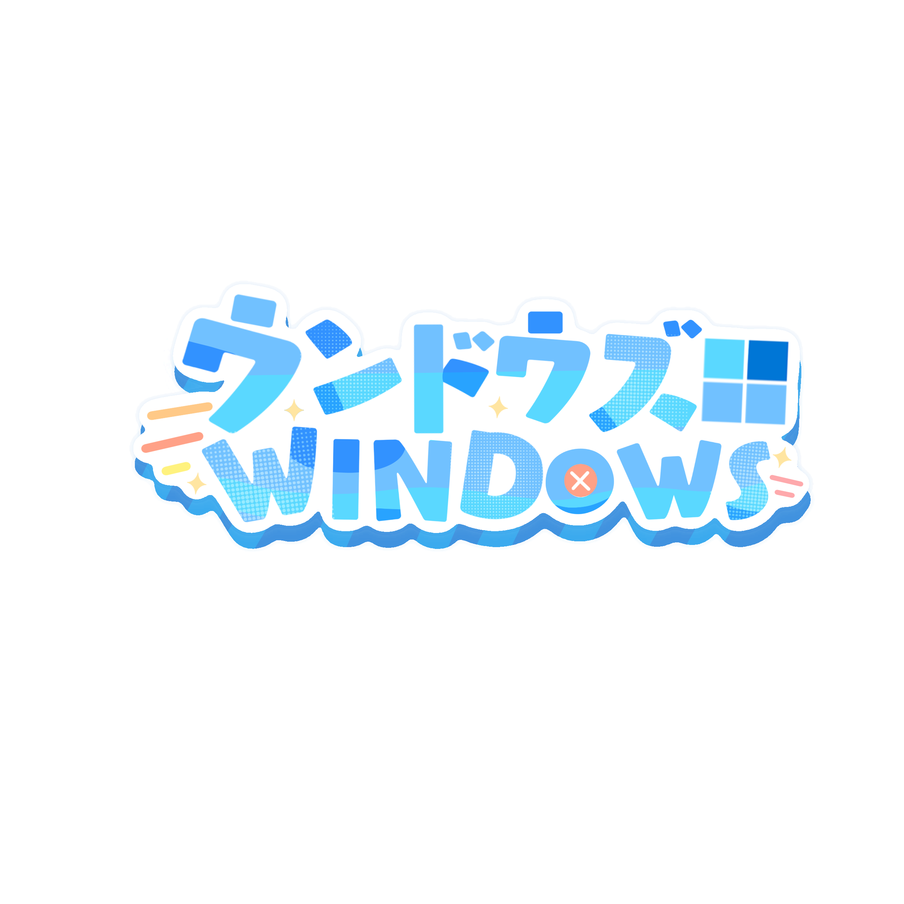

# Programming VTuber Logos for Windows

Everything here shares the same principle as the [main repo](https://github.com/Aikoyori/ProgrammingVTuberLogos) by [Aikoyori](https://github.com/Aikoyori), so don't use anything here comercially.

## Windows Logo

## License

**~~I always use WTFPL in my own project, but this project is different.~~**

Licensed under [CC-BY-NC-SA-4.0](https://creativecommons.org/licenses/by-nc-sa/4.0/deed.en)

> [!IMPORTANT]
> In addition to the permissions granted by the CC BY-NC-SA 4.0 license, I am open to providing further permissions upon request. If you require more open permissions for the logos provided under this license, please feel free to contact me. I am willing to consider granting additional permissions on a case-by-case basis.

### Permitted

___

- **Sharing, Modification, Redistribution:** You are free to share, modify, and redistribute the logos under the same license (CC BY-NC-SA 4.0 ).
- **Attribution:** You must credit me for the original work.
- **Noncommercial Use:** The logos may be used for noncommercial purposes.

### Prohibited

___

- **Commercial Use:** You may not sell the logos without obtaining permission.
